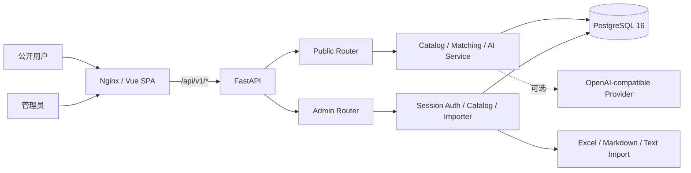
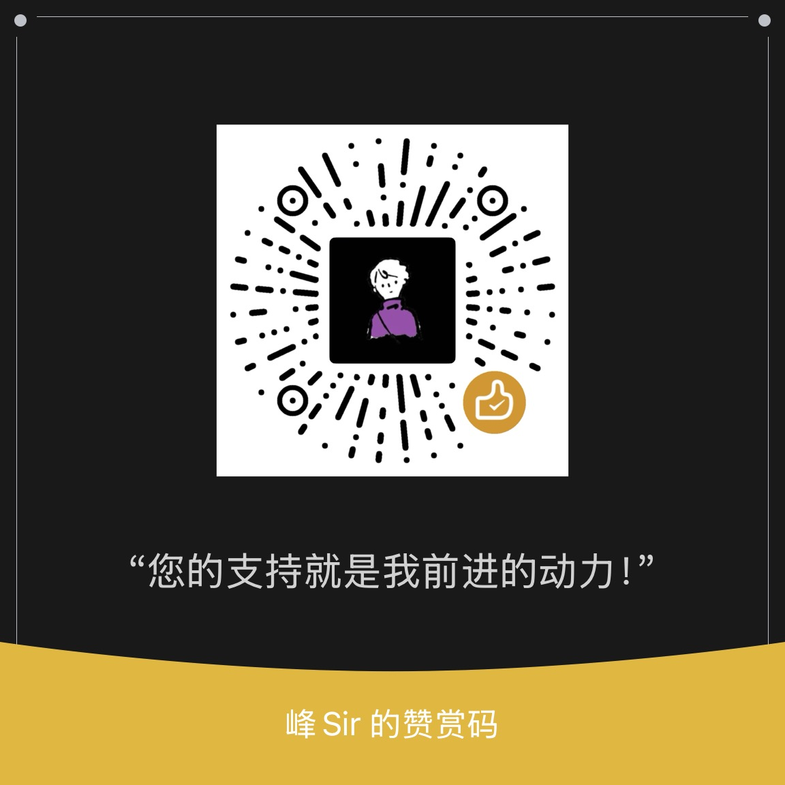

# 天枢 TenSpur — 企业产品库

> 面向企业的产品资料管理、分类检索、产品对比与辅助选型平台，支持软件、硬件及其他产品类型的统一管理。
>
> **English summary:** A sanitized, self-hosted enterprise product catalog for unified software, hardware, and other product types, with public browsing, comparison, authenticated administration, governed imports, and optional evidence-bounded AI assistance.

[](LICENSE)
[](frontend/package.json)
[](backend/pyproject.toml)
[](docker-compose.yml)

## 项目定位与适用场景

天枢 TenSpur 是一个可自托管的企业产品库：面向企业的产品资料管理、分类检索、产品对比与辅助选型平台，支持软件、硬件及其他产品类型的统一管理。仓库名 `Digital-Middle-Platform` 以及源码内部 `hardware-product-library-*` 技术包名、数据库迁移和代码类名中的 `hardware` 等均为历史技术标识，为兼容性保留，不代表产品边界，也不作为用户可见产品名。平台将“对外可浏览的产品目录”和“对内受认证的数据维护后台”放在同一套数据模型与 API 之上，并提供字段字典、结构化导入、兼容关系和可选 AI 选型能力。

适合：

- 建立软件、服务器、工作站、存储、GPU 及其他产品的统一资料目录；
- 为售前、方案、渠道或研发团队提供型号检索、详情和横向比较；
- 将 Excel、Markdown 或粘贴文本逐步治理为结构化规格；
- 维护生命周期、业务标签、GPU 附件兼容关系与来源证据；
- 在本地目录证据约束下接入 OpenAI-compatible Provider 辅助选型；
- 作为脱敏后的二次开发基线、教学示例或内部原型。

不适合直接当作生产主数据包或生产升级包。本仓库不含任何真实产品库、客户数据、生产配置、证书、品牌 Logo、内部域名/IP、备份或私有资料。

## 核心功能与公开源码边界

| 能力 | 公开源码中的实现 |
|---|---|
| 公开目录 | 按品牌、产品类型、系列浏览，关键词搜索，型号详情、规格分组、生命周期与业务标签展示 |
| 产品比较 | 可选择 2–4 个型号横向比较，并支持“仅看差异” |
| 管理后台 | `/admin` 单页应用；登录会话、型号 CRUD、规格编辑、软删除、系列与 GPU 兼容关系维护 |
| 导入 | Excel 模板下载、预览/执行；Markdown 预览/执行；粘贴文本规格识别 |
| 字段治理 | 受控规格分组、标准字段、别名识别、稳定 raw 字段键、字段字典 guard 与审计 |
| GPU | GPU 规格字段、槽宽/散热约束、整机—GPU 兼容关系、兼容候选展示与测试覆盖 |
| AI 选型 | 可选 OpenAI-compatible Provider；后端先做本地候选、硬条件和证据矩阵，Provider 仅辅助解释；无证据时拒绝编造 |
| 响应式 | 公开页、比较区和后台包含桌面/平板/移动端专项样式；主要移动断点从 1024px 及以下开始 |
| PDF / 文档 | 公开 Web/Nginx **没有** PDF 代理、私有文档仓或真实白皮书素材；仅可展示数据中已有的外部链接字段。仓库内开发指南 PDF 是交付文档，不是产品资料库 |

> **视觉区说明：** 本 README 不放真实业务截图，也不链接内部素材。若需要展示界面，请在自有演示数据环境生成截图，并在发布前再次检查数据、域名、账号和浏览器信息是否已脱敏。

## 技术栈与锁定版本

| 层 | 技术 / 版本 |
|---|---|
| 前端 | Vue `3.4.38`、Element Plus `2.7.8`、TypeScript `5.5.4`、Vite `5.4.2`、vue-tsc `2.0.29` |
| 前端测试 | Vitest `^2.1.9`、Vue Test Utils `^2.4.11`、Happy DOM `^15.11.7`、Playwright `^1.61.1` |
| 后端 | Python `>=3.12`（镜像 `3.12.9-slim`）、FastAPI `0.111.1`、Uvicorn `0.30.3` |
| 数据层 | SQLAlchemy `2.0.31`、Alembic `1.13.2`、Psycopg `3.2.1`、PostgreSQL `16` |
| 数据处理 | Pydantic `2.8.2`、pydantic-settings `2.4.0`、OpenPyXL `3.1.5`、Beautiful Soup `4.12.3` |
| Web / 交付 | Nginx `1.27.5-alpine`、Docker Compose |

准确版本以 [`frontend/package-lock.json`](frontend/package-lock.json)、[`frontend/package.json`](frontend/package.json)、[`backend/pyproject.toml`](backend/pyproject.toml) 与 Dockerfile 为准。

## 系统架构



运行链路：浏览器访问 Nginx 静态 SPA；`/api/` 被反向代理到 FastAPI；公开路由读取 active 且未软删除的数据；后台路由通过 Bearer 会话认证后执行写操作；SQLAlchemy 访问 PostgreSQL。AI 请求由后端先计算本地候选与约束，再按配置决定是否调用外部 Provider。

## 快速开始：Docker Compose

### 1. 准备环境

需要 Docker Engine 与 Compose v2。克隆仓库并复制示例配置：

```bash
git clone https://github.com/hello-fengsir/Digital-Middle-Platform.git
cd Digital-Middle-Platform
cp .env.example .env
```

将 `.env` 中的所有 `replace-with-...` 替换为本机生成的强随机值，禁止继续使用示例值或将 `.env` 提交到 Git。

### 2. 校验并启动基础服务

```bash
docker compose config

docker compose up --build -d
```

Compose 暴露 `http://localhost:8080`，PostgreSQL 仅在 Compose 默认网络内可见。API 健康检查：

```bash
curl http://localhost:8080/api/v1/health
```

### 3. 初始化空库 Schema

API 启动脚本只启动 Uvicorn，**不会自动运行迁移或导入数据**。首次部署必须显式执行：

```bash
docker compose run --rm api alembic upgrade head
```

迁移完成后刷新页面。空库不会自动出现品牌、型号或演示数据，这是公开脱敏版的预期状态。

### 4. 管理认证配置注意事项

后端当前认证代码读取 `ADMIN_PASSWORD_HASH` 与 `ADMIN_SESSION_SECRET`，密码摘要格式为 `sha256:<64位十六进制摘要>`；而公开示例 Compose 中仍使用兼容占位名 `ADMIN_PASSWORD` / `SESSION_SECRET`。因此，在正式开放 `/admin` 前，请在自有部署编排中显式传入后端实际变量并限制后台入口；不要把摘要或 secret 写入仓库。生成摘要的示例：

```bash
python -c 'import hashlib,getpass; print("sha256:" + hashlib.sha256(getpass.getpass().encode()).hexdigest())'
```

该差异不影响公开目录和健康接口，但未正确配置时后台登录会被拒绝。这也是公开示例与生产部署之间需要由运维方完成的安全接线，而不是默认弱口令。

停止服务：

```bash
docker compose down
# 如需删除本机数据库卷（不可恢复）：docker compose down -v
```

## 环境变量

下表同时列出 Compose 示例变量和后端 `Settings` 实际支持的变量。示例均为占位值，不包含秘密。

| 变量名 | 用途 | 示例占位 | 必需性 |
|---|---|---|---|
| `POSTGRES_DB` | PostgreSQL 数据库名 | `producthub` | 可选，Compose 有默认值 |
| `POSTGRES_USER` | PostgreSQL 用户名 | `producthub` | 可选，Compose 有默认值 |
| `POSTGRES_PASSWORD` | PostgreSQL 密码 | `<strong-random-password>` | **Compose 必需** |
| `DATABASE_URL` | SQLAlchemy 连接串 | `postgresql+psycopg://<user>:<password>@db:5432/<db>` | **Compose 必需** |
| `ADMIN_USERNAME` | 后台用户名 | `admin` | 可选，默认 `admin` |
| `ADMIN_PASSWORD_HASH` | 后台密码 SHA-256 摘要，格式 `sha256:...` | `sha256:<64-hex>` | **启用后台必需**；需在部署编排中传入 |
| `ADMIN_SESSION_SECRET` | 后台 HMAC 会话签名 secret | `<long-random-secret>` | **启用后台必需**；需在部署编排中传入 |
| `ADMIN_SESSION_TTL_SECONDS` | 后台会话有效期（秒） | `28800` | 可选 |
| `ADMIN_PASSWORD` | 公开 Compose 兼容占位；当前后端不直接读取明文密码 | `<strong-password>` | Compose 当前要求，但不能代替 `ADMIN_PASSWORD_HASH` |
| `SESSION_SECRET` | 公开 Compose 兼容占位；当前后端实际读取 `ADMIN_SESSION_SECRET` | `<long-random-secret>` | Compose 当前要求，但不能代替实际变量 |
| `API_KEY` | `X-API-Key` 客户端校验使用的默认值 | `<random-api-key>` | 仅相关受保护 API 流程需要；不要使用默认值 |
| `CORS_ORIGINS` | 允许的跨域来源，逗号分隔 | `https://catalog.example.invalid` | 可选；生产环境不要使用 `*` |
| `AI_BASE_URL` | OpenAI-compatible API 基址 | `https://provider.example.invalid/v1` | AI 可选 |
| `AI_API_KEY` | AI Provider Key | `<provider-key>` | AI 可选；不启用可留空 |
| `AI_MODEL` | 模型名 | `example-model` | AI 可选 |
| `AI_MAX_CONCURRENCY` | AI 调用并发上限 | `4` | 可选 |
| `AI_TOTAL_TIMEOUT_SECONDS` | AI 总超时秒数 | `75` | 可选 |
| `AI_SELECTION_AGENT_RULE_PATH` | 固定 AI 规则 Markdown 文件路径 | `/app/runtime-prompts/AI_SELECTION_AGENT.md` | AI 规则管理可选；必须是受控挂载路径 |

AI Provider 请求可能离开本地部署边界。启用前应完成数据分类、用户告知、供应商评估和日志策略。

## 本地前后端开发

### 后端

```bash
cd backend
python3.12 -m venv .venv
. .venv/bin/activate
python -m pip install -e '.[test]'
export DATABASE_URL='postgresql+psycopg://<user>:<password>@localhost:5432/<db>'
alembic upgrade head
uvicorn app.main:app --reload --host 127.0.0.1 --port 8000
```

FastAPI 交互文档默认位于 `http://127.0.0.1:8000/docs`，OpenAPI JSON 位于 `/openapi.json`。不要在公网直接暴露开发服务器。

### 前端

```bash
cd frontend
npm ci
npm run dev
```

Vite 开发服务默认端口通常为 `5173`。仓库当前 Nginx 配置负责容器内 `/api/` 反代；本地前后端分离开发时，可通过本地反向代理、同源网关或自行在 `vite.config.ts` 中添加仅用于本机的 proxy。不要把内部 API 地址提交到公共仓库。

## 数据库与 Alembic：仅限空库

公开仓库保留 `0001`—`0012` 的 revision lineage、表结构、约束和公开行为测试，但生产数据修复、回填和特定数据清理已删除或改为 no-op/schema-only。

- 支持：在**全新空 PostgreSQL 数据库**上执行 `alembic upgrade head`；
- 不支持：用公开迁移链升级任何私有生产库、恢复生产备份或复现生产数据；
- 不包含：seed、真实品牌/型号、导入源文件、数据库 dump、备份和迁移证据；
- 生产升级必须使用生产项目自己的受控迁移、备份、演练和回滚流程。

可先查看 SQL（仍需人工审查）：

```bash
cd backend
alembic upgrade head --sql
```

## 目录结构

```text
.
├── backend/
│   ├── app/
│   │   ├── main.py              # FastAPI 工厂、CORS、422 脱敏、路由注册
│   │   ├── routes/public.py     # 公开目录、搜索、兼容性与 AI 推荐 API
│   │   ├── routes/admin.py      # 登录、后台 CRUD、导入、AI 配置与规则 API
│   │   ├── catalog.py           # 目录查询、字段映射、写入与审计业务
│   │   ├── importer.py          # Excel / Markdown / 文本识别导入
│   │   ├── ai_service.py        # 本地证据约束、候选计算、Provider 调用
│   │   ├── ai_agent_rule.py     # 固定规则文件读写与边界
│   │   ├── model_matching.py    # 型号与条件匹配
│   │   ├── security.py          # API Key、管理员 HMAC 会话
│   │   ├── models.py            # SQLAlchemy ORM
│   │   └── schemas.py           # Pydantic 输入输出
│   ├── alembic/versions/        # 公开 schema-only 迁移链
│   └── tests/                   # Pytest 后端契约测试
├── frontend/
│   ├── src/App.vue              # 公开目录根页面
│   ├── src/components/          # 导航、详情、比较、AI、标签组件
│   ├── src/admin/AdminApp.vue   # 管理后台根页面
│   ├── src/admin/components/    # 导入、字段、GPU、AI 配置等组件
│   ├── src/utils/               # 展示、目录加载、推荐结果工具与测试
│   └── tests/                   # 浏览器/接口错误测试
├── docs/                        # 开发指南、源码清单与文档验证产物
├── tools/                       # 清单生成与交付文档验证脚本
├── docker-compose.yml
├── DEPLOYMENT.md
├── SECURITY.md
├── PRIVACY.md
└── PUBLIC_RELEASE_MANIFEST.md
```

完整逐文件清单见 [`docs/SOURCE_INVENTORY.md`](docs/SOURCE_INVENTORY.md)。

## 关键前端组件与后端入口

### 前端

- `frontend/src/main.ts`：按路径挂载公开 `App` 或 `/admin` 的 `AdminApp`；
- `components/ModelNavigator.vue`：类型—系列—型号导航与搜索；
- `components/ModelDetail.vue`：型号摘要、规格分组、来源与兼容 GPU；
- `components/ProductCompare.vue`：2–4 型号比较和差异过滤；
- `components/AiAssistant.vue`：AI 需求输入、证据结果和候选跳转；
- `admin/components/AdminImportPanel.vue`：Excel/Markdown 预览与执行；
- `AdminSpecEditor.vue` / `AdminRecognitionPanel.vue`：字段字典与文本识别；
- `AdminCompatibleGpuPanel.vue`：整机—GPU 兼容关系；
- `AdminAiConfigPanel.vue` / `AdminAiAgentRulePanel.vue`：Provider 和固定规则管理。

### 后端

- `app.main:create_app`：应用入口；
- `app.routes.public:router`：`/api/v1` 公开 API；
- `app.routes.admin:router`：`/api/v1/admin` 管理 API；
- `app.catalog`：目录读取、字段治理、模型与规格写服务；
- `app.importer`：导入解析与预览；
- `app.ai_service`：确定性约束、证据矩阵与可选 Provider；
- `app.security`：管理员 Bearer 会话、HMAC 签名和 API Key 校验。

## API 与认证概述

公开 API 前缀为 `/api/v1`：

- `GET /health`、`/brands`、`/product-types`、`/series`；
- `GET /models`、`/models/{id}`、`/models/{id}/specifications`、`/search`；
- `GET /cpu-compatibility`、`/cpu-compatibility/summary`；
- `POST /ai/recommend`。

管理 API 前缀为 `/api/v1/admin`，包括：

- `/auth/login`、`/auth/me`、`/auth/logout`、`/auth/nginx`；
- 型号、规格定义、系列、GPU 兼容关系 CRUD；
- Excel / Markdown 导入与文本规格识别；
- AI Provider 配置测试、Key 删除、固定规则读写。

后台登录成功后使用 HMAC 签名的 Bearer 会话；管理路由由 `require_admin_session` 保护。部分服务代码还支持 `X-API-Key` 客户端认证。API Key 以 SHA-256 摘要比对，但不能替代 TLS、访问控制、限流、审计和密钥轮换。422 校验响应会删除请求输入回显和文档 URL，以降低敏感输入泄露风险。

## AI 的证据边界

AI 是可选增强，不是事实来源：

1. 后端解析用户条件并在本地目录中筛选候选；
2. 为硬条件生成满足、冲突或未知的证据矩阵；
3. Provider 仅补充解释与风险提示，不能越权改写候选和匹配状态；
4. 缺少本地证据时返回拒答/不确定，而不是补造参数；
5. Provider 失败或未配置时应保持目录基本功能可用。

请勿向外部 Provider 发送客户名称、报价、未公开规格、账号、凭据或其他受限数据。

## 测试、类型检查与构建

```bash
# 前端单元测试
cd frontend && npm ci && npm test

# TypeScript / Vue 类型检查
cd frontend && npx vue-tsc -b

# 生产构建（已包含 vue-tsc）
cd frontend && npm run build

# 后端完整测试
cd backend && python -m pytest -q

# Compose 展开校验
POSTGRES_PASSWORD='<placeholder>' \
DATABASE_URL='postgresql+psycopg://producthub:<placeholder>@db:5432/producthub' \
ADMIN_PASSWORD='<placeholder>' SESSION_SECRET='<placeholder>' \
docker compose config

# 补充静态检查
git diff --check
```

### 当前公开基线验证

README 更新提交前后的实际验证结果记录如下（文档变更不修改运行代码）：

| 检查 | 结果 |
|---|---|
| 前端 Vitest | PASS |
| Vue / TypeScript 类型检查 | PASS |
| 前端生产构建 | PASS |
| 后端 Pytest | `116 passed` |
| Docker Compose config | PASS（使用占位环境变量，不含秘密） |
| 敏感模式与文件名扫描 | PASS |
| `git diff --check` | PASS |
| README 相对链接 / Markdown fence / Mermaid 基本结构 | PASS |

精确命令输出以当前提交的验证过程为准；不同 Docker、Node、Python 或依赖镜像环境可能产生差异。

## 安全、隐私与文档版权

- **秘密管理：** 永不提交 `.env`、私钥、Token、数据库 dump、日志、上传文件或证书；所有示例值必须替换；
- **网络：** PostgreSQL 不应映射公网端口；生产使用 HTTPS、可信反向代理、最小权限网络和后台访问限制；
- **认证：** 配置强随机会话 secret，轮换凭据，限制后台入口；默认/示例值不得用于生产；
- **AI 隐私：** 外部 Provider 可能使请求离开部署边界，启用前必须完成告知、授权和供应商评估；
- **数据责任：** 运营方负责数据来源合法性、授权范围、保留/删除、备份、审计和事件响应；
- **文档与素材版权：** 仓库不授予第三方产品彩页、白皮书、商标、Logo、截图或厂商内容的再分发权。自行导入或链接资料前，请确认版权与使用许可；
- **漏洞报告：** 请按 [`SECURITY.md`](SECURITY.md) 私下联系维护者，不要在公开 Issue 中粘贴凭据、客户数据或漏洞利用细节。

## 公开版与私有生产版边界

本仓库是**源码脱敏公开版**，不是私有生产项目的镜像：

| 包含 | 明确不包含 |
|---|---|
| 前后端源码、公开测试、通用 Docker/Nginx 示例 | 生产数据库、dump、备份、seed、客户/产品真实数据 |
| Schema-only Alembic revision lineage | 私有生产数据修复与回填逻辑 |
| 通用环境变量名和占位值 | `.env`、真实域名/IP、账号、密码、Token、证书 |
| 开发指南与机器可读源码清单 | 内部部署证据、日志、导入源文件、私有规则内容 |
| CSS 文本品牌与无业务数据 UI | 组织 Logo、真实截图、内部素材、产品 PDF 仓 |

请勿把公开仓库迁移覆盖到私有生产库，也不要把私有项目文件“同步回来”后提交。完整边界见 [`PUBLIC_RELEASE_MANIFEST.md`](PUBLIC_RELEASE_MANIFEST.md) 与 [`HANDOVER.md`](HANDOVER.md)。

## 文档

- [开发指南（Markdown）](docs/DEVELOPER_GUIDE.md)
- [开发指南（HTML）](docs/DEVELOPER_GUIDE.html)
- [开发指南（PDF）](docs/DEVELOPER_GUIDE.pdf)
- [源码清单](docs/SOURCE_INVENTORY.md)
- [部署说明](DEPLOYMENT.md)
- [安全策略](SECURITY.md)
- [隐私说明](PRIVACY.md)
- [公开发布范围](PUBLIC_RELEASE_MANIFEST.md)
- [交接边界](HANDOVER.md)
- [变更日志](CHANGELOG.md)

## 故障排查

### `docker compose config` 提示变量未设置

先复制 `.env.example`，替换所有占位符；检查 `POSTGRES_PASSWORD`、`DATABASE_URL`、`ADMIN_PASSWORD`、`SESSION_SECRET` 是否存在。不要在聊天或 Issue 中贴出展开后的真实值。

### 页面可打开但没有品牌或型号

公开版不带 seed 或生产数据，空目录是正常状态。先确认已执行 `alembic upgrade head`，再通过自有后台导入经过授权的演示数据。

### API 报数据库表不存在

API 启动不会自动迁移。执行：

```bash
docker compose run --rm api alembic current
docker compose run --rm api alembic upgrade head
```

### 后台无法登录

确认后端容器实际获得 `ADMIN_USERNAME`、`ADMIN_PASSWORD_HASH`、`ADMIN_SESSION_SECRET`，并注意公开 Compose 的两个兼容占位名不能自动替代实际变量。检查系统时间是否准确、会话是否过期，但不要输出 secret。

### AI 显示不可用或超时

AI 是可选能力。检查 Provider Base URL、模型名、网络连通性、超时和并发配置；确认规则文件路径已受控挂载。不要把 Key 写入日志。Provider 不可用时，公开目录仍应可浏览。

### 前端请求 API 失败

检查 `docker compose ps`、API 健康接口及 Nginx `/api/` 反代；本地 Vite 分离开发时需要自建同源代理。浏览器 502/503/504 会被转换为有限的用户提示。

### 不应出现的 PDF 或内部链接

公开 Nginx 不提供 PDF 代理。如果页面数据中出现资料链接，它来自运营方自行导入的数据；请检查链接授权、访问控制和隐私，不要恢复私有文档仓配置。

## 赞赏与支持 / Support

如果天枢 TenSpur 对你有帮助，欢迎通过 Star、Fork、Issue、PR 或自愿赞赏支持持续维护。



赞赏完全自愿，不构成购买或服务合同，也不影响本项目的开源许可。

## 贡献指南

欢迎以小而清晰、可验证的变更参与：

1. **Star** 项目以便持续关注；
2. **Fork** 仓库并从 `main` 创建功能分支；
3. 修改前阅读开发指南、安全策略和公开边界；
4. 不提交真实数据、品牌素材、内部地址、凭据或私有迁移；
5. 为行为变化补充测试，并运行前端测试/类型/构建、后端 Pytest、Compose config 和敏感扫描；
6. 使用清晰的 Conventional Commit 风格提交；
7. 发起 **Pull Request**，说明动机、边界、测试结果和兼容性影响；
8. 一般问题或功能建议可开 **Issue**；安全问题必须私下报告。

欢迎 Star、Fork、Issue 与 PR。提交贡献即表示你有权提供相关代码/文档，并同意其按本项目许可证分发。

## 许可证

本项目代码以 [MIT License](LICENSE) 发布。MIT 许可不自动覆盖你自行导入的第三方数据、商标、产品资料、PDF、截图或其他内容；这些内容的授权责任由部署与运营方承担。

## 天仓 TianCang 产品文档管理子模块

`tiancang/` 是天枢 TenSpur 企业产品库的独立产品文档管理子模块，保留现有企业产品库定位与全部产品目录/对比/选型能力。它提供管理员 Cookie 认证、目录/PDF API、PDF 上传、新建目录、删除 PDF/空目录、匿名公开 PDF、内置 PDF.js 在线预览（缩放/旋转/浏览器返回）、移动端/PC 布局、路径越界防护和独立 Docker 健康检查。

公开仓库不含真实产品材料或生产资料；命名卷 `tiancang-pdfs` 默认为空，测试只使用运行时临时虚构 PDF 并在结束后清理。Viewer 在 360/390 窄屏将工具栏优先分行，返回按钮触控区不小于 44px，缩放与旋转保持可见可操作。返回契约是确定性的：仅接受同源且路径严格为 `/` 的 `return` 参数或 referrer，否则回退 `/`，并通过 `location.assign()` 返回；不使用 `history.back()`，不允许开放重定向。部署前必须设置强随机 `TIANCANG_ADMIN_PASSWORD` 与 `TIANCANG_SESSION_SECRET`。第三方许可见 [`tiancang/LICENSES.md`](tiancang/LICENSES.md)。
