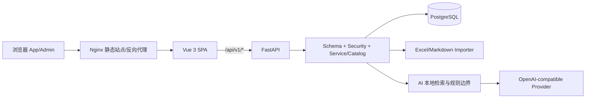
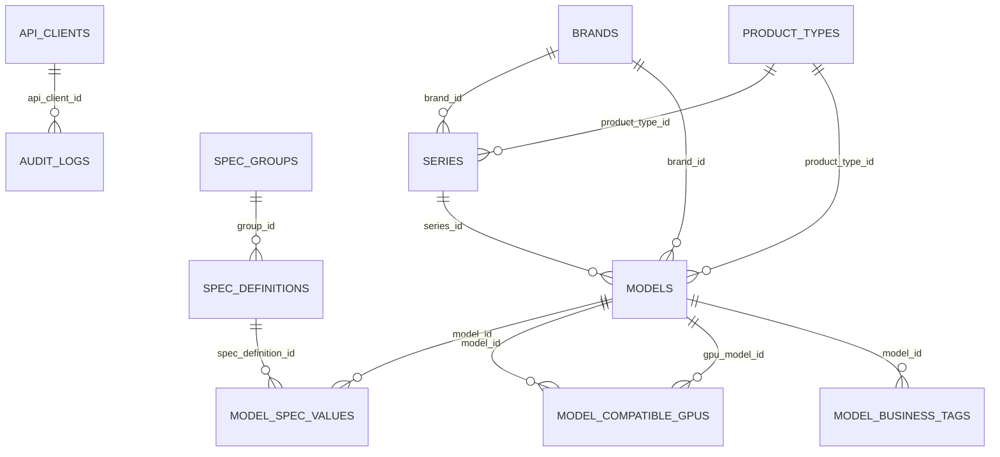

# 天枢 TenSpur 开发指南（公开脱敏版）

> 文档性质：源码取证型交接文档。所有结构、文件、路由、组件、依赖和迁移均由随包 `SOURCE_INVENTORY.json` 从本交付树提取；未读取或抄录任何凭据值。

- 交接内容基线 SHA-256：`8d0dd4cbd02ddc9ff34305a3a5190f7d9cb70bbe`
- 外层归档 SHA-256：归档生成后记录在同目录 `SHA256SUMS`/`.sha256`；归档不能把自身最终 SHA 写入自身而仍保持该 SHA。
- 配置值查询：仅由接手人到部署主机检查 `.env`、`docker compose config`、容器环境和密钥管理系统；禁止粘贴到工单/聊天。

## 1. 系统定位与边界

天枢 TenSpur 是企业产品库，即面向企业的产品资料管理、分类检索、产品对比与辅助选型平台，支持软件、硬件及其他产品类型的统一管理。公开 App 负责按品牌/产品类型/系列浏览、全文检索、型号详情、当前已有的 GPU 兼容关系、生命周期标签与多型号对比；Admin 负责受认证的型号/规格维护、Excel/Markdown 导入、规格识别、AI Provider 与固定规则 MD。源码中的 `hardware` 等包名、迁移名和代码标识属于历史技术标识，不代表产品边界。AI 不能替代本地证据：候选、条件矩阵和无证据拒答由后端确定，Provider 只补充风险说明。

## 2. 架构与请求链



典型公开请求：浏览器 → Nginx `/api/` → FastAPI public router → SQLAlchemy 查询 active/未软删数据 → Pydantic 响应 → Vue 状态与组件渲染。管理写请求：登录得到 Bearer token 和 HttpOnly Cookie → Admin API `Depends(require_admin_session)` → 校验/业务事务 → PostgreSQL；Cookie 专供 Nginx `auth_request`。

## 3. 语言、框架与版本（声明文件）

- `backend/pyproject.toml`：`{"requires_python": ">=3.12", "dependencies": ["alembic==1.13.2", "beautifulsoup4==4.12.3", "fastapi==0.111.1", "psycopg[binary]==3.2.1", "pydantic==2.8.2", "pydantic-settings==2.4.0", "sqlalchemy==2.0.31", "uvicorn[standard]==0.30.3", "openpyxl==3.1.5"], "optional_dependencies": {"test": ["httpx==0.27.0", "pytest==8.3.2"]}}`
- `frontend/package.json`：`{"name": "hardware-product-library-web", "version": "0.1.0", "dependencies": {"@vitejs/plugin-vue": "5.1.2", "element-plus": "2.7.8", "typescript": "5.5.4", "vite": "5.4.2", "vue": "3.4.38", "vue-tsc": "2.0.29"}, "devDependencies": {"@playwright/test": "^1.61.1", "@vue/test-utils": "^2.4.11", "happy-dom": "^15.11.7", "vitest": "^2.1.9"}, "scripts": {"dev": "vite --host 0.0.0.0", "build": "vue-tsc -b && vite build", "test": "vitest run", "preview": "vite preview --host 0.0.0.0"}}`

运行镜像/工具链以 Dockerfile、Compose 和 lock 文件为准；不要用文档中的“最新版本”替换锁定版本。

## 4. 交付树与模块

机器清单统计：Python `39`，TS/TSX `25`，Vue `18`，受检源码/配置/文档 `112`。完整逐文件树见本节和 `SOURCE_INVENTORY.md`。
```text
CHANGELOG.md
DEPLOYMENT.md
HANDOVER.md
PRIVACY.md
PUBLIC_RELEASE_MANIFEST.md
README.md
SECURITY.md
SENSITIVE_SCAN.json
backend/Dockerfile
backend/alembic.ini
backend/alembic/env.py
backend/alembic/versions/0001_initial_schema.py
backend/alembic/versions/0002_cpu_compatibility.py
backend/alembic/versions/0003_gpu_slot_cooling.py
backend/alembic/versions/0004_ai_config_compatible_gpu.py
backend/alembic/versions/0005_gpu_relation_constraints_acceptance_cleanup.py
backend/alembic/versions/0006_gpu_parent_guard_import_trim_whitepaper.py
backend/alembic/versions/0007_nf5468a7_cross_platform_cleanup.py
backend/alembic/versions/0008_nf5468a7_cn_cpu_notes_cleanup.py
backend/alembic/versions/0009_controlled_lifecycle_tags.py
backend/alembic/versions/0010_field_dictionary_guard.py
backend/alembic/versions/0011_merge_auto_field_definitions.py
backend/alembic/versions/0012_normalize_interface_fields.py
backend/app/__init__.py
backend/app/ai_agent_rule.py
backend/app/ai_service.py
backend/app/catalog.py
backend/app/config.py
backend/app/db.py
backend/app/importer.py
backend/app/main.py
backend/app/model_matching.py
backend/app/models.py
backend/app/routes/__init__.py
backend/app/routes/admin.py
backend/app/routes/public.py
backend/app/schemas.py
backend/app/security.py
backend/entrypoint.sh
backend/pyproject.toml
backend/tests/test_ai_agent_rule.py
backend/tests/test_ai_input_contract.py
backend/tests/test_ai_numeric_constraints.py
backend/tests/test_api.py
backend/tests/test_field_dictionary_governance.py
backend/tests/test_gpu_constraints_cleanup.py
backend/tests/test_lifecycle_migration_contract.py
backend/tests/test_public_schema_only_migrations.py
backend/tests/test_validation_error_redaction.py
docker-compose.yml
docs/DEVELOPER_GUIDE.md
docs/SOURCE_INVENTORY.json
docs/SOURCE_INVENTORY.md
frontend/Dockerfile
frontend/index.html
frontend/nginx.conf
frontend/package-lock.json
frontend/package.json
frontend/src/App.vue
frontend/src/admin/AdminApp.test.ts
frontend/src/admin/AdminApp.vue
frontend/src/admin/admin-components.css
frontend/src/admin/admin.css
frontend/src/admin/adminAiAgentRuleApi.test.ts
frontend/src/admin/adminApi.test.ts
frontend/src/admin/adminApi.ts
frontend/src/admin/components/AdminAiAgentRulePanel.test.ts
frontend/src/admin/components/AdminAiAgentRulePanel.vue
frontend/src/admin/components/AdminAiConfigPanel.test.ts
frontend/src/admin/components/AdminAiConfigPanel.vue
frontend/src/admin/components/AdminBasicForm.vue
frontend/src/admin/components/AdminCompatibleGpuPanel.test.ts
frontend/src/admin/components/AdminCompatibleGpuPanel.vue
frontend/src/admin/components/AdminImportPanel.test.ts
frontend/src/admin/components/AdminImportPanel.vue
frontend/src/admin/components/AdminModelList.vue
frontend/src/admin/components/AdminRecognitionPanel.vue
frontend/src/admin/components/AdminSpecEditor.vue
frontend/src/admin/components/SeriesSelector.vue
frontend/src/admin/components/SpecRows.vue
frontend/src/api.ts
frontend/src/components/AiAssistant.vue
frontend/src/components/BrandHeader.vue
frontend/src/components/ModelDetail.vue
frontend/src/components/ModelNavigator.vue
frontend/src/components/ProductBadges.vue
frontend/src/components/ProductCompare.vue
frontend/src/env.d.ts
frontend/src/main.ts
frontend/src/style.css
frontend/src/styles/compare.css
frontend/src/styles/mobile-public.css
frontend/src/styles/mobile-scroll-admin.css
frontend/src/utils/adminRedirect.test.ts
frontend/src/utils/adminRedirect.ts
frontend/src/utils/aiRecommendation.test.ts
frontend/src/utils/aiRecommendation.ts
frontend/src/utils/catalogLoader.test.ts
frontend/src/utils/catalogLoader.ts
frontend/src/utils/displayRules.ts
frontend/src/utils/gpuDisplay.test.ts
frontend/src/utils/gpuDisplay.ts
frontend/src/utils/homeUx.test.ts
frontend/src/utils/productBadges.test.ts
frontend/src/utils/productBadges.ts
frontend/tests/api-error.test.ts
frontend/tests/gpu-display-browser.mjs
frontend/tests/gpu-save-browser.mjs
frontend/tsconfig.json
frontend/vite.config.ts
tools/tenspur_source_inventory.py
tools/verify_handover_docs.py
```

## 5. 前端入口、页面、响应式与 PC 冻结

- `frontend/src/main.ts` 按 URL：`/admin*` 挂载 `AdminApp`，其余挂载 `App`。
- App 页面：品牌头、型号导航、型号详情、对比、AI助手。Admin 页面：登录态、型号列表/表单、规格、GPU兼容、识别、导入、AI Provider、AI规则。
- 全局样式：`style.css`、`styles/compare.css`；后台：`admin/admin.css`、`admin/admin-components.css`；移动专项：`styles/mobile-public.css`、`styles/mobile-scroll-admin.css`（公开树实际存在时）。
- 响应式边界来自 CSS：公开/后台在 1024px 及以下进入移动/平板规则，另有 767/720/640/560/430/420 和低高度横屏规则。
- **PC冻结原则**：移动改动只能写在最大宽度媒体查询或移动专用样式内；不得改桌面基础选择器的几何、字号、色彩、层级或交互。提交前用 1366/1440/1920 三档截图与 DOM 几何对比；差异必须归因。

### 5.1 Vue 组件逐项职责 / props / events / state

| 文件 / 组件 | 职责 | Props | Events | 响应式状态 |
|---|---|---|---|---|
| `frontend/src/App.vue` / `App` | 公开目录根编排：品牌/类型/系列/型号筛选、详情加载、对比与AI入口。 | 无 | 无 | `brandOptions`, `browseScrollY`, `catalogLoading`, `collapsedSeries`, `collapsedTypes`, `compareBusy`, `compareOnlyDiff`, `compareOpen`, `compareRowsFiltered`, `currentBrandName`, `currentCount`, `detailLoading`, `filteredModels`, `groupedSpecs`, `isMobileViewport`, `keyword`, `mobileNavigatorOpen`, `mobileOverlayOpen`, `navigationGroups`, `pageProductTitle`, `selectedBrand`, `selectedType`, `selectionNotesText`, `summaryCards`, `suppressBrandWatch`, `suppressKeywordWatch`, `typeFilteredModels`, `typeFilters` |
| `frontend/src/admin/AdminApp.vue` / `AdminApp` | 后台根编排：登录会话、型号/规格/导入/识别/AI配置与规则管理。 | 无 | 无 | `adminToken`, `adminUser`, `aiAgentRuleOpen`, `aiConfigBusy`, `aiConfigDeleting`, `aiConfigHasKey`, `aiConfigOpen`, `aiConfigTesting`, `basicForm`, `canWrite`, `compatibleGpusDirty`, `creating`, `filteredModels`, `formSeriesBrand`, `formSeriesLoading`, `formSeriesMessage`, `formSeriesOptions`, `formSeriesPlaceholder`, `hasApiKey`, `importBusy`, `isDeletedDetail`, `isGpuAccessoryDetail`, `isLoggedIn`, `keyword`, `loading`, `loginForm`, `markdownImportText`, `newSeriesName`, `notice`, `productTypes`, `recognitionMessage`, `recognitionText`, `recognizingSpecs`, `savingBasic`, `savingCompatibleGpus`, `savingSpecs`, `selectedBrand`, `selectedFormBrand`, `selectedFormSeries`, `selectedSeries`, `selectedType`, `seriesOptions`, `sortedSpecDefinitions`, `storagePreviewSpec`, `storagePreviewText` |
| `frontend/src/admin/components/AdminAiAgentRulePanel.vue` / `AdminAiAgentRulePanel` | 固定AI规则MD读取、编辑、保存、全屏与状态展示。 | 无 | `saved` | `canSave`, `content`, `dirty`, `editorFullscreen`, `formattedUpdatedAt`, `isCompact`, `loading`, `message`, `saving`, `serverContent` |
| `frontend/src/admin/components/AdminAiConfigPanel.vue` / `AdminAiConfigPanel` | OpenAI兼容Provider配置、Key状态、测试与删除Key。 | `busy`, `deleting`, `form`, `hasApiKey`, `testing` | `deleteKey`, `save`, `test` | 无 |
| `frontend/src/admin/components/AdminBasicForm.vue` / `AdminBasicForm` | 型号主数据、系列选择、保存和删除入口。 | `basicForm`, `brands`, `creating`, `detailModelName`, `formSeriesLoading`, `formSeriesMessage`, `formSeriesOptions`, `formSeriesPlaceholder`, `hasApiKey`, `isDeletedDetail`, `newSeriesName`, `productTypeOptions`, `savingBasic`, `selectedFormSeries` | `remove-current`, `remove-selected-series`, `save-basic`, `update:newSeriesName` | `newSeriesNameProxy` |
| `frontend/src/admin/components/AdminCompatibleGpuPanel.vue` / `AdminCompatibleGpuPanel` | 整机与GPU附件兼容关系选择。 | `dirty`, `disabled`, `gpuOptions`, `saving`, `selectedIds` | `save`, `update:selectedIds` | `filteredOptions`, `gpuExpanded`, `isCompact`, `keyword`, `visibleOptions` |
| `frontend/src/admin/components/AdminImportPanel.vue` / `AdminImportPanel` | Excel/Markdown模板、预览、执行导入。 | `importBusy`, `importFile`, `importPreview`, `markdownText` | `clear-preview`, `download-template`, `preview-import`, `preview-markdown`, `run-import`, `run-markdown`, `update:importFile`, `update:markdownText` | `isCompact`, `markdownFullscreen` |
| `frontend/src/admin/components/AdminModelList.vue` / `AdminModelList` | 后台筛选、状态切换、型号列表与新建入口。 | `brands`, `creating`, `detailId`, `filteredModels`, `keyword`, `loading`, `productTypes`, `selectedBrand`, `selectedSeries`, `selectedType`, `seriesOptions`, `statusFilter` | `active`, `all`, `deleted`, `refresh`, `select-model`, `start-create`, `update:keyword`, `update:selectedBrand`, `update:selectedSeries`, `update:selectedType`, `update:statusFilter` | `canCollapseModels`, `currentModel`, `hasMoreModels`, `isResponsive`, `navigatorOpen`, `visibleCount`, `visibleModels` |
| `frontend/src/admin/components/AdminRecognitionPanel.vue` / `AdminRecognitionPanel` | 粘贴规格文本并预识别字段。 | `creating`, `definitionOptionLabel`, `isDeletedDetail`, `recognitionMessage`, `recognitionText`, `recognizedSpecs`, `recognizingSpecs`, `sortedSpecDefinitions`, `visible` | `apply`, `recognize`, `recognized-field-change`, `update:recognitionText` | 无 |
| `frontend/src/admin/components/AdminSpecEditor.vue` / `AdminSpecEditor` | 规格行维护、字段字典选择和保存。 | `creating`, `hasApiKey`, `isDeletedDetail`, `savingSpecs`, `specDefinitionOptionsFor`, `specsForm`, `storagePreviewText` | `add-spec`, `definition-change`, `remove-spec`, `save-specs` | 无 |
| `frontend/src/admin/components/SeriesSelector.vue` / `SeriesSelector` | 受品牌/产品类型约束的系列选择与新系列名。 | `basicForm`, `creating`, `formSeriesLoading`, `formSeriesMessage`, `formSeriesOptions`, `formSeriesPlaceholder`, `hasApiKey`, `newSeriesName`, `selectedFormSeries` | `remove-selected-series`, `update:newSeriesName` | `disabled`, `newSeriesNameProxy`, `seriesSelectRequired` |
| `frontend/src/admin/components/SpecRows.vue` / `SpecRows` | 规格编辑器的逐行渲染、字段变更和移除。 | `showAdvanced`, `specDefinitionOptionsFor`, `specsForm` | `definition-change`, `remove-spec` | 无 |
| `frontend/src/components/AiAssistant.vue` / `AiAssistant` | 公开页AI问诊浮层；提交需求、展示本地证据与跳转候选。 | 无 | `jump-model`, `open-change` | `busy`, `input`, `open` |
| `frontend/src/components/BrandHeader.vue` / `BrandHeader` | 品牌切换、当前品牌标题和型号数头部。 | `brandOptions`, `currentBrandName`, `currentCount`, `pageProductTitle`, `selectedBrand` | `update:selectedBrand` | 无 |
| `frontend/src/components/ModelDetail.vue` / `ModelDetail` | 单型号详情、规格分组、来源提示、刷新及加入对比。 | `detail`, `groupedSpecs`, `isCompareSelected`, `loading`, `selectionNotesText`, `summaryCards` | `jump-model`, `refresh-detail`, `toggle-compare` | `collapsedGroups` |
| `frontend/src/components/ModelNavigator.vue` / `ModelNavigator` | 类型→系列→型号导航与关键词输入。 | `isTypeOpen`, `keyword`, `loading`, `navigationGroups`, `selectedModelId`, `selectedType`, `typeFilters` | `select-model`, `select-type`, `toggle-series`, `toggle-type`, `update:keyword` | 无 |
| `frontend/src/components/ProductBadges.vue` / `ProductBadges` | 型号生命周期/业务标签展示。 | 无 | 无 | `items` |
| `frontend/src/components/ProductCompare.vue` / `ProductCompare` | 2–4型号对比抽屉/模态框及仅看差异。 | `compareBusy`, `compareDetails`, `compareIds`, `compareOnlyDiff`, `compareOpen`, `compareRowsFiltered` | `clear`, `close`, `open`, `remove`, `update:compareOnlyDiff` | 无 |

## 6. 后端模块

- `app/main.py`：FastAPI 工厂、CORS、422 输入回显脱敏、路由注册。
- `app/routes/public.py`：健康、目录查询、检索、CPU兼容、AI推荐。
- `app/routes/admin.py`：登录/会话、管理查询写入、导入、AI配置与规则。
- `app/schemas.py`：Pydantic 输入输出、生命周期/业务标签枚举、2000字符上限、显式 null 规则。
- `app/catalog.py`：active 查询、目录序列化、字段映射、型号/规格/GPU关系写服务、审计与事务。
- `app/security.py`：密码摘要校验、HMAC 会话、Bearer 管理依赖、API Key hash 工具。
- `app/importer.py`：Excel模板与预览、Markdown解析、字段字典校验、HTML/CPU批导工具。
- `app/ai_service.py`：确定性需求解析、本地证据矩阵、Provider调用、并发/超时、无证据拒答。
- `app/ai_agent_rule.py`（存在时）：固定路径 MD 的每次调用前读取、原子替换、固定名备份、补偿恢复、不可覆盖边界。
- `app/models.py` / `db.py`：ORM 与会话。

## 7. 数据库实际 ORM 关系



ORM 实际业务表：`brands`、`product_types`、`series`、`models`、`model_business_tags`、`spec_groups`、`spec_definitions`、`model_spec_values`、`model_compatible_gpus`、`ai_provider_configs`、`cpu_compatibility`、`api_clients`、`audit_logs`。物理库另含 Alembic 元数据；私有包 `database/schema.sql` 是物理表/约束最终证据，若与 ORM 不一致按迁移漂移处理。

## 8. Alembic 0001–0012 迁移链

链：`0001_initial_schema → 0002_cpu_compatibility → 0003_gpu_slot_cooling → 0004_ai_config_compatible_gpu → 0005_gpu_rel_cleanup → 0006_gpu_parent_guard_import_trim_whitepaper → 0007_nf5468a7_cross_platform_cleanup → 0008_nf5468a7_cn_cpu_notes_cleanup → 0009_controlled_lifecycle_tags → 0010_field_dictionary_guard → 0011_merge_auto_fields → 0012_normalize_interface_fields`。

| Revision | Down revision | 文件 | 交接说明 |
|---|---|---|---|
| `0001_initial_schema` | `None` | `backend/alembic/versions/0001_initial_schema.py` | 初始目录/规格/API客户端/审计 schema |
| `0002_cpu_compatibility` | `0001_initial_schema` | `backend/alembic/versions/0002_cpu_compatibility.py` | CPU兼容性 |
| `0003_gpu_slot_cooling` | `0002_cpu_compatibility` | `backend/alembic/versions/0003_gpu_slot_cooling.py` | GPU槽宽/散热相关变更或公开版兼容标记 |
| `0004_ai_config_compatible_gpu` | `0003_gpu_slot_cooling` | `backend/alembic/versions/0004_ai_config_compatible_gpu.py` | AI配置与兼容GPU |
| `0005_gpu_rel_cleanup` | `0004_ai_config_compatible_gpu` | `backend/alembic/versions/0005_gpu_relation_constraints_acceptance_cleanup.py` | GPU关系约束与验收清理 |
| `0006_gpu_parent_guard_import_trim_whitepaper` | `0005_gpu_relation_constraints_acceptance_cleanup` | `backend/alembic/versions/0006_gpu_parent_guard_import_trim_whitepaper.py` | GPU父实体 guard、导入收窄与白皮书清理 |
| `0007_nf5468a7_cross_platform_cleanup` | `0006_gpu_parent_guard_import_trim_whitepaper` | `backend/alembic/versions/0007_nf5468a7_cross_platform_cleanup.py` | 特定平台交叉数据清理；公开版为 no-op |
| `0008_nf5468a7_cn_cpu_notes_cleanup` | `0007_nf5468a7_cross_platform_cleanup` | `backend/alembic/versions/0008_nf5468a7_cn_cpu_notes_cleanup.py` | 中文CPU备注清理；公开版为 no-op |
| `0009_controlled_lifecycle_tags` | `0008_nf5468a7_cn_notes` | `backend/alembic/versions/0009_controlled_lifecycle_tags.py` | 受控生命周期/业务标签；公开版只保留 schema |
| `0010_field_dictionary_guard` | `0009_controlled_lifecycle_tags` | `backend/alembic/versions/0010_field_dictionary_guard.py` | 字段字典数据库 guard |
| `0011_merge_auto_fields` | `0010_field_dictionary_guard` | `backend/alembic/versions/0011_merge_auto_field_definitions.py` | 自动字段合并；公开版为 no-op |
| `0012_normalize_interface_fields` | `0011_merge_auto_fields` | `backend/alembic/versions/0012_normalize_interface_fields.py` | 接口字段归一化/guard；公开版不回填生产数据 |

公开版保留 revision lineage，但生产数据修复迁移被改为 no-op/schema-only；只能从空库部署，绝不能用来升级私有生产库。

## 9. AI 规则 / Provider / Key 边界

- 固定规则位置由 `AI_SELECTION_AGENT_RULE_PATH` 指向；私有运行包通常挂载 `config/AI_SELECTION_AGENT.md`，实际路径查 Compose/容器 inspect，不在文档复制内容。
- 每次 Provider 调用前读取规则；后端追加不可覆盖 system 边界。规则只能影响措辞、解释、风险提示，不能改变候选、条件结果、匹配状态、无证据拒答。
- Provider 为 OpenAI-compatible `/chat/completions`；Base URL/Model 可在管理接口返回，Key 只返回 `has_api_key`，不得回显。
- Key来源优先级和清空语义以 `_effective_ai()` 为准：已有 DB 行权威；空 cipher 表示无 Key，不回退环境。删除 Key 同时禁用 AI 并写审计。
- 当前 `api_key_cipher` 是基于部署 secret 的 XOR 可逆混淆，不是现代加密/密钥托管；属于高优先级技术债。

## 10. Nginx 边界（公开版）

公开版 Nginx 只含 SPA 和 `/api/` 反代，并添加基础安全响应头；不含私有天仓、PDF代理、真实域名、TLS证书挂载或内部地址。若自行接入文档仓，必须单独设计 auth_request 矩阵并做未认证 401/302 验证。

## 11. Docker 服务 / 端口 / 卷 / 网络

| Compose | 服务 | 端口 | 卷 | 网络 |
|---|---|---|---|
| `docker-compose.yml` | `db` | `[]` | `['db-data:/var/lib/postgresql/data']` | `[]` |
| `docker-compose.yml` | `api` | `[]` | `[]` | `[]` |
| `docker-compose.yml` | `web` | `['8080:80']` | `[]` | `[]` |

未显式声明网络时 Compose 创建项目默认网络；数据库不应映射宿主公网端口。私有包还包含有效 Compose、容器/image/volume/network inspect 和离线镜像。

## 12. API 清单与权限矩阵

权限口径：`Public`=无管理依赖；`Admin Bearer`=函数参数 `Depends(require_admin_session)`；`Admin Cookie`=仅 Nginx 子请求；测试 probe 不属于生产 API。

| 方法 | 路径 | 函数 | 权限 |
|---|---|---|---|
| `POST` | `/api/v1/admin/auth/login` | `backend/app/routes/admin.py::admin_login()` | Public endpoint（登录校验/清 Cookie） |
| `GET` | `/api/v1/admin/auth/nginx` | `backend/app/routes/admin.py::admin_nginx_auth()` | Admin Cookie |
| `GET` | `/api/v1/admin/auth/me` | `backend/app/routes/admin.py::admin_me()` | Admin Bearer |
| `POST` | `/api/v1/admin/auth/logout` | `backend/app/routes/admin.py::admin_logout()` | Public endpoint（登录校验/清 Cookie） |
| `GET` | `/api/v1/admin/spec-groups` | `backend/app/routes/admin.py::admin_spec_groups()` | Admin Bearer |
| `GET` | `/api/v1/admin/spec-definitions` | `backend/app/routes/admin.py::admin_spec_definitions()` | Admin Bearer |
| `PATCH` | `/api/v1/admin/spec-definitions/{spec_id}` | `backend/app/routes/admin.py::admin_patch_spec_definition()` | Admin Bearer |
| `DELETE` | `/api/v1/admin/series/{series_id}` | `backend/app/routes/admin.py::admin_delete_series()` | Admin Bearer |
| `GET` | `/api/v1/admin/models` | `backend/app/routes/admin.py::admin_models()` | Admin Bearer |
| `GET` | `/api/v1/admin/models/{model_id}` | `backend/app/routes/admin.py::admin_model_detail()` | Admin Bearer |
| `POST` | `/api/v1/admin/spec-recognition/preview` | `backend/app/routes/admin.py::admin_spec_recognition_preview()` | Admin Bearer |
| `GET` | `/api/v1/admin/import/template` | `backend/app/routes/admin.py::admin_import_template()` | Admin Bearer |
| `POST` | `/api/v1/admin/import/preview` | `backend/app/routes/admin.py::admin_import_preview()` | Admin Bearer |
| `POST` | `/api/v1/admin/import/run` | `backend/app/routes/admin.py::admin_import_run()` | Admin Bearer |
| `POST` | `/api/v1/admin/import/markdown/preview` | `backend/app/routes/admin.py::admin_markdown_import_preview()` | Admin Bearer |
| `POST` | `/api/v1/admin/import/markdown/run` | `backend/app/routes/admin.py::admin_markdown_import_run()` | Admin Bearer |
| `POST` | `/api/v1/admin/models` | `backend/app/routes/admin.py::admin_create()` | Admin Bearer |
| `PATCH` | `/api/v1/admin/models/{model_id}` | `backend/app/routes/admin.py::admin_patch()` | Admin Bearer |
| `PUT` | `/api/v1/admin/models/{model_id}/compatible-gpus` | `backend/app/routes/admin.py::admin_replace_compatible_gpus()` | Admin Bearer |
| `DELETE` | `/api/v1/admin/models/{model_id}` | `backend/app/routes/admin.py::admin_delete()` | Admin Bearer |
| `PUT` | `/api/v1/admin/models/{model_id}/specifications` | `backend/app/routes/admin.py::admin_put_specs()` | Admin Bearer |
| `POST` | `/api/v1/admin/models/upsert` | `backend/app/routes/admin.py::admin_upsert()` | Admin Bearer |
| `GET` | `/api/v1/admin/gpu-options` | `backend/app/routes/admin.py::admin_gpu_options()` | Admin Bearer |
| `GET` | `/api/v1/admin/ai-config` | `backend/app/routes/admin.py::admin_ai_config()` | Admin Bearer |
| `PUT` | `/api/v1/admin/ai-config` | `backend/app/routes/admin.py::admin_put_ai_config()` | Admin Bearer |
| `DELETE` | `/api/v1/admin/ai-config/api-key` | `backend/app/routes/admin.py::admin_delete_ai_config_api_key()` | Admin Bearer |
| `POST` | `/api/v1/admin/ai-config/test` | `backend/app/routes/admin.py::admin_test_ai_config()` | Admin Bearer |
| `GET` | `/api/v1/admin/ai-agent-rule` | `backend/app/routes/admin.py::admin_ai_agent_rule()` | Admin Bearer |
| `PUT` | `/api/v1/admin/ai-agent-rule` | `backend/app/routes/admin.py::admin_put_ai_agent_rule()` | Admin Bearer |
| `GET` | `/api/v1/health` | `backend/app/routes/public.py::health()` | Public |
| `GET` | `/api/v1/brands` | `backend/app/routes/public.py::brands()` | Public |
| `GET` | `/api/v1/product-types` | `backend/app/routes/public.py::product_types()` | Public |
| `GET` | `/api/v1/spec-definitions` | `backend/app/routes/public.py::spec_definitions()` | Public |
| `GET` | `/api/v1/series` | `backend/app/routes/public.py::series()` | Public |
| `GET` | `/api/v1/models` | `backend/app/routes/public.py::models()` | Public |
| `GET` | `/api/v1/models/{model_id}` | `backend/app/routes/public.py::model_detail()` | Public |
| `GET` | `/api/v1/models/{model_id}/specifications` | `backend/app/routes/public.py::model_specifications()` | Public |
| `GET` | `/api/v1/search` | `backend/app/routes/public.py::search()` | Public |
| `GET` | `/api/v1/cpu-compatibility/summary` | `backend/app/routes/public.py::cpu_compatibility_summary()` | Public |
| `GET` | `/api/v1/cpu-compatibility` | `backend/app/routes/public.py::cpu_compatibility()` | Public |
| `POST` | `/api/v1/ai/recommend` | `backend/app/routes/public.py::ai_recommend()` | Public |
| `POST` | `/validation-probe` | `backend/tests/test_validation_error_redaction.py::validation_probe()` | Test only |

注意：`security.py::require_api_client()` 存在不等于当前路由实际挂载。以路由函数参数为准。

## 13. 测试、构建与数量口径

- 后端：`cd backend && python3 -m pytest -q`。
- 前端：`cd frontend && npm ci && npm test && npm run build`。
- 类型/构建：`npm run build` 内含 `vue-tsc -b && vite build`。
- Compose：`docker compose config`；Python静态：`python3 -m compileall backend/app backend/alembic`。
- 路由/组件/迁移/服务数量来自机器清单；测试通过数量必须以本次随包 `verification/` 原始日志为准，不用历史口头数字。

## 14. 开发、部署、升级、备份与回滚

### 本地开发
1. 从 `.env.example` 创建本地 `.env`，生成独立随机 secret。
2. 后端安装 test extra，前端 `npm ci`；先跑测试再改。
3. 只在空测试库跑迁移；私有生产 dump 只在隔离环境恢复。

### 构建部署
1. 备份 DB（custom dump + globals/schema）、规则 MD、配置、证书和上传/材料；生成 SHA。
2. `docker compose config` 审核最终渲染，不输出 secret。
3. `docker compose build`；记录 image ID/digest。
4. `docker compose up -d`；等待 db/api health。
5. 私有迁移执行 `alembic upgrade head`；公开版只允许空库。
6. 验证 health、公开浏览、Admin登录、读写、AI无证据拒答和日志。

### 升级/回滚
- 升级前记录 Git SHA、工作树 patch、Alembic current/head、容器 inspect 和卷。先在 dump 克隆库演练 0001→0012/当前→head。
- 应用回滚优先切回旧 image/source + 恢复迁移前 DB dump；不能假定所有 downgrade 可无损。
- 规则 MD 保存有固定名 `.bak`，但不能替代包级备份。

## 15. 日志与排障

| 现象 | 检查 | 处理 |
|---|---|---|
| Web 502/504 | `docker compose ps/logs web api`、API health | 检查 api health、超时和反代上游 |
| Admin 401 | Bearer 是否发送、session secret/TTL、客户端时钟 | 重新登录；不打印 token |
| 天仓循环登录 | Cookie Secure/域名/path、auth subrequest 204 | 通过实际浏览器和 Nginx access/error log 验证 |
| AI 失败 | Provider启用、has_api_key、URL/Model、超时/并发 | 用后台测试；日志不得打印 Authorization/body secret |
| AI 编造 | provenance、条件矩阵、规则来源 | 后端候选门禁优先；无证据必须拒答 |
| 导入失败 | preview errors、字段字典、事务 rollback | 先预览；未知/raw字段禁止自动新增 |
| 迁移失败 | `alembic current/heads/history`、PG约束 | 停止写入，用隔离库重现后恢复备份 |
| 页面横向溢出 | 真实视口 `scrollWidth/innerWidth`、控制台 | 修移动媒体规则，不碰PC基础样式 |

## 16. 已知风险 / 技术债

1. 私有 Nginx 根级 PDF 资源路径未见 `auth_request`，需确认是否确属公开资源，否则统一保护。
2. 管理密码仅 `sha256:` 单次摘要，无盐无工作因子，应迁移到 Argon2id/bcrypt/PBKDF2。
3. AI Key 的 XOR 是混淆而非加密，应迁入 Vault/KMS/系统密钥环并支持轮换。
4. 登录响应同时返回 Bearer token；浏览器 JS持有 token，XSS 风险高于纯 HttpOnly Cookie。可评估管理 API 统一 Cookie+CSRF。
5. CORS 私有模板可能宽松；生产必须精确 origin。
6. 导入循环是否整批原子取决于 `upsert_model` 内部 commit；需要持续用事务失败注入测试证明整批回滚。
7. ORM 与物理 schema/迁移需持续漂移检测；SQLite测试不能证明全部 PostgreSQL trigger/partial index。
8. 大型 `ai_service.py` 规则密集，建议拆分 parser/evidence/ranker/provider 并建立属性测试。
9. 私有树包含历史备份/输入/材料，体积大且敏感；公开树必须继续 allowlist 构建。

## 17. 接手第一天 / 第一周

### 第一天
- 核验归档 SHA、`SOURCE_INVENTORY.json` 和交接清单。
- 只读检查 Compose、容器、镜像、卷、网络、Git状态、Alembic current/head。
- 定位 `.env`/证书/规则 MD/DB dump，但不复制值到文档。
- 跑后端测试、前端测试/构建、Compose config。
- 走通公开浏览、Admin登录、一个预览不写流程和 AI 无证据拒答。
- 做一次隔离恢复并记录时长。

### 第一周
- 建立 CI：compile/pytest/vitest/vue-tsc/vite build/secret scan/Compose/迁移空库。
- 建立生产备份、恢复演练、日志保留和告警。
- 整改密码 hash、AI Key 存储、Nginx PDF公开面和CORS。
- 为迁移链在真实 PostgreSQL 跑 upgrade/downgrade/restore 门禁。
- 将 PC冻结和手机/平板视口纳入 Playwright，阻断横向溢出与控制台错误。
- 书面确认公开版许可证、品牌/数据版权与发布边界。

## 18. 机器核对与覆盖结论

- Vue：文档表 `18` / 清单 `18`。
- FastAPI：文档表 `42` / 清单 `42`（含测试 probe 时已标 Test only）。
- Alembic：文档表 `12` / 清单 `12`，0001–0012 线性链。
- Compose：文档表 `3` / 清单 `3`。
- 自动核对脚本：`tools/tenspur_source_inventory.py` 生成 JSON/MD；`tools/verify_handover_docs.py` 做集合覆盖与脱敏扫描。

## 17. 天仓 TianCang 产品文档管理子模块

`tiancang/` 是天枢 TenSpur 企业产品库的产品文档管理子模块，不改变企业产品库主定位。后端 `app.py` 提供 Cookie 管理员认证、`/api/files`、`/api/dirs`、上传/建目录/删除和匿名 `/public/pdfs/{path}`；`clean_rel`/`target` 共同阻断绝对路径、`..` 与解析后越界。`static/` 是管理界面，`pdfjs/` 是 Apache-2.0 的内置阅读器。`Dockerfile` 使用非 root 用户，Compose 命名卷 `tiancang-pdfs` 默认空。

开发测试：`cd tiancang && pytest -q`。集成验收使用临时虚构 `%PDF-` 文件，覆盖 360、390、844、1024 与 PC 视口并检查 `documentElement.scrollWidth <= innerWidth`、控制台/页面错误、PDF.js 缩放/旋转/返回；测试后删除文件和空目录并确认默认卷 PDF=0。缩放采样必须等待 `currentScale` 到达目标或 canvas 尺寸变化；旋转采样必须等待 `pagesRotation === 90` 或 canvas 方向变化。Viewer 返回契约固定为：仅接受同源且 pathname 严格为 `/` 的 `return`/referrer，拒绝其余目标并回退 `/`，使用 `location.assign()`，禁止 `history.back()`。360/390 响应式修复只能放在天仓自有 CSS/JS 覆盖中，不得大改上游 PDF.js。不得把真实 PDF、运行卷、凭据、IP/域名或测试产物提交到 Git。
